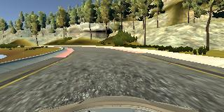

# **Behavioral Cloning** 

---

**Behavioral Cloning Project**

The goals / steps of this project are the following:
* Use the simulator to collect data of good driving behavior
* Build, a convolution neural network in Keras that predicts steering angles from images
* Train and validate the model with a training and validation set
* Test that the model successfully drives around track one without leaving the road
* Summarize the results with a written report

## Rubric Points
### Here I will consider the [rubric points](https://review.udacity.com/#!/rubrics/432/view) individually and describe how I addressed each point in my implementation.  

---
### Files Submitted & Code Quality

#### 1. Submission includes all required files and can be used to run the simulator in autonomous mode

My project includes the following files:
* model.py containing the script to create and train the model
* drive.py for driving the car in autonomous mode
* model.h5 containing a trained convolution neural network 
* writeup_report.md summarizing the results

#### 2. Submission includes functional code
Using the Udacity provided simulator and my drive.py file, the car can be driven autonomously around the track by executing 
```sh
python drive.py model.h5
```

#### 3. Submission code is usable and readable

The model.py file contains the code for training and saving the convolution neural network. The file shows the pipeline I used for training and validating the model, and it contains comments to explain how the code works.

### Model Architecture and Training Strategy

#### 1. An appropriate model architecture has been employed

The neural network that I have used is highly inspired from Nvidia deep convolutional neural network, described here https://images.nvidia.com/content/tegra/automotive/images/2016/solutions/pdf/end-to-end-dl-using-px.pdf

Nvidia reference cnn architecture                                     |
:-------------------------------------------------------------------: |
                          |

Network consists of a normalization layer, followed by 5 convolutional layers, followed by 4 fully connected layers.

#### 2. Attempts to reduce overfitting in the model

The model contains dropout layers in order to reduce overfitting (model.py lines 111). 

The model was trained and validated on different data sets to ensure that the model was not overfitting. The model was tested by running it through the simulator and ensuring that the vehicle could stay on the track.

#### 3. Model parameter tuning

The model used an adam optimizer, so the learning rate was not tuned manually (model.py line 131).

#### 4. Appropriate training data

Training data was chosen to keep the vehicle driving on the road. I used a combination of center lane driving, recovering from the left and right sides of the road, data augmentation, left and right camera data.

For details about how I created the training data, see the next section.

### Architecture and Training Documentation

#### 1. Solution Design Approach

The overall strategy for deriving a model architecture was to ...

My first step was to use a convolution neural network model similar to the ... I thought this model might be appropriate because ...

In order to gauge how well the model was working, I split my image and steering angle data into a training and validation set. I found that my first model had a low mean squared error on the training set but a high mean squared error on the validation set. This implied that the model was overfitting. 

To combat the overfitting, I modified the model so that ...

Then I ... 

The final step was to run the simulator to see how well the car was driving around track one. There were a few spots where the vehicle fell off the track... to improve the driving behavior in these cases, I ....

At the end of the process, the vehicle is able to drive autonomously around the track without leaving the road.

#### 2. Final Model Architecture

The final model architecture (model.py lines 87-126) consisted of a normalization layere followed by 5 convolution layers and then followed by 4 fully connected layeres.

#### 3. Creation of the Training Set & Training Process

To capture good driving behavior, I first recorded two laps on track one using center lane driving. Here is an example image of center lane driving:

Example center lane driving                                     |
:-------------------------------------------------------------: |
                             |


I then recorded the vehicle recovering from the left side and right sides of the road back to center so that the vehicle would learn to come back to center of the lane if by chance it goes towards the corner. This is very important for stable driving.

To augment the data sat, I also flipped images and angles, this doubled the data size and generalized the data for both clock and anti-clock wise turning. This will help to get generalized data and prevent network to get baised over clock/anti-clock wise turns. Here is an example of fliped image.

Example Original image                                     | Fliped Image                        
:---------------------------------------------------------:|:-------------------------------------------------------:
                        |


Since the whole image was not required to decide how to drive, In preprocessing I croped the image to have one road. Here is an example:

Example Original image                                     | Cropped Image                        
:---------------------------------------------------------:|:-------------------------------------------------------:
                        |


I finally randomly shuffled the data set and put 20% of the data into a validation set. 

I used this training data for training the model. The validation set helped determine if the model was over or under fitting. Number of epochs was 5, after which validation error was not changing much and I was able to drive the car. I used an adam optimizer so that manually training the learning rate wasn't necessary.


### Simulation
Car is able to drive on the track successfully.
